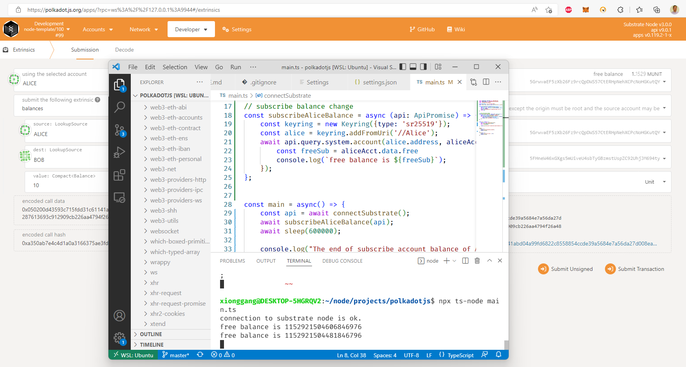

README.md

* The 6th Homework of learn substract basic

** Subscribe the balance query event of Substrate account

* How to use it 
```
yarn install
yarn start
```
At the same time, you must start substrate local node
```
./target/debug/node-template --dev --tmp
```
Then the front UI console will show the free balance of Alice account like below:
```
xionggang@DESKTOP-5HGRQV2:~/node/projects/polkadotjs$ npx ts-node main.ts
connection to substrate node is ok.
free balance is 1152921504606846976
free balance is 1152921504481846796
```
The screen shot like below:
